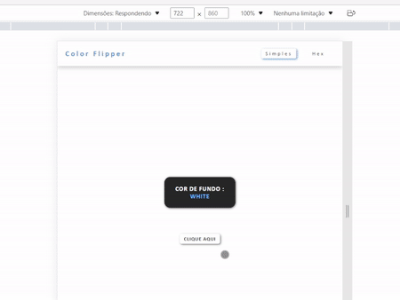

# Color-Flipper-JavaScrpit
Aplicação web simples que muda a cor de fundo aleatoriamente.
É a minha primeira vez utilizando conceitos como 
*document.querySelector()*, *addEventListener()*,  *document.body.style.backgroundColor*. 

